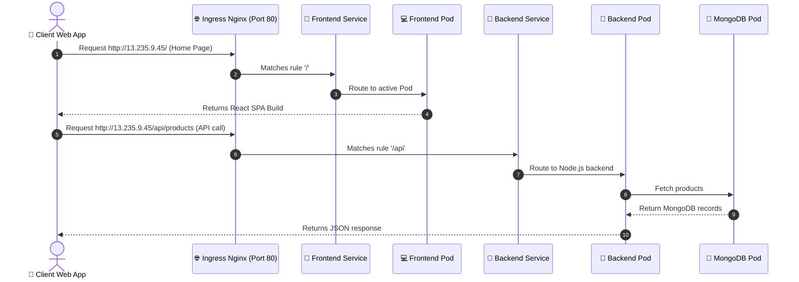
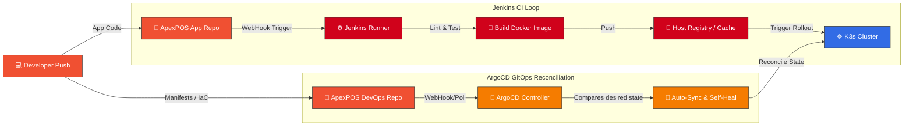

# ☁️ ApexPOS DevOps Infrastructure & Orchestration Hub

[](https://www.terraform.io/)
[](https://kubernetes.io/)
[](https://helm.sh/)
[](https://aws.amazon.com/)
[](https://www.jenkins.io/)
[](https://argo-cd.readthedocs.io/)
[](https://www.docker.com/)

This repository serves as the central **Infrastructure as Code (IaC)**, **GitOps**, and **Orchestration Hub** for the ApexPOS software suite. It contains production Terraform configurations, Kubernetes raw manifests, Helm Charts, and automated delivery pipelines.

---

## 🏛️ Overall DevOps & Network Architecture

The deployment is hosted on **AWS EC2** running a single-node **K3s Kubernetes cluster** inside a secure custom VPC network.


---

## 🚦 Traffic & Ingress Routing Flow

This diagram illustrates how client requests are routed through the networking stack down to the respective application pods.



---

## 🔄 Dual GitOps & CI/CD Pipeline Flow

Our delivery architecture separates concerns by utilizing **Jenkins** for Continuous Integration (CI) and **ArgoCD** for GitOps Continuous Delivery (CD).



---

## 📁 Repository Directory Layout

```text
├── helm/
│   └── apexpos/              # Premium Helm chart packaging for ApexPOS
│       ├── templates/        # Kubernetes resource templates (Deployments, Services, Ingress)
│       ├── Chart.yaml        # Chart metadata
│       └── values.yaml       # Global values configurations
├── k8s/                      # Raw Kubernetes manifests (Alternative to Helm)
│   ├── namespace.yml         # Shared Namespace setup
│   ├── backend/              # Deployment, ClusterIP Service, ConfigMap & Secrets
│   ├── database/             # MongoDB Deployment, Service, PVC
│   ├── frontend/             # Nginx reverse proxy configuration & UI Deployment
│   ├── ingress.yml           # Traffic routing rule manifest
│   └── argocd-app.yml        # GitOps Application definition
└── terraform/                # Infrastructure as Code (IaC)
    └── aws-cloud-production/ # Production environment VPC & Host setup
        ├── providers.tf      # Cloud provider configurations
        ├── variables.tf      # System variables & defaults
        ├── vpc.tf            # Custom VPC, subnets, route tables, & gateway
        ├── security_groups.tf# Firewall rules for HTTP/HTTPS/SSH/Jenkins
        ├── ec2.tf            # EC2 instance bootstrapping (Docker, K3s, Jenkins setups)
        └── outputs.tf        # Access IP addresses & host values
```

---

## 📊 Observability Stack (Prometheus + Grafana)

ApexPOS ships a full monitoring stack using the [`kube-prometheus-stack`](https://github.com/prometheus-community/helm-charts/tree/main/charts/kube-prometheus-stack) Helm chart, optimized for the `t3.small` resource profile.

### Components

| Component | Role | Port |
|---|---|---|
| **Prometheus** | Metrics scraping & storage (7-day retention) | Internal |
| **Grafana** | Visualization dashboards | `NodePort 30300` |
| **Node Exporter** | Host-level CPU / RAM / Disk metrics | DaemonSet |
| **Kube State Metrics** | Kubernetes object state metrics | ClusterIP |

### Custom ApexPOS Dashboard

A pre-built Grafana dashboard (`apexpos-overview`) is auto-loaded via a ConfigMap and displays:

- 🖥️ **Node CPU, Memory & Disk usage** (real-time)
- 🚀 **Pod CPU & Memory** for the `apexpos` namespace
- 🟢 **Running pod count** health indicator
- 🍃 **MongoDB pod restart counter** for stability monitoring

### Install Monitoring Stack

```bash
# Run from devops-repo root (requires kubectl + helm configured)
bash monitoring/install-monitoring.sh
```

### Access Grafana

```
URL      : http://<EC2_PUBLIC_IP>:30300
Username : admin
Password : ApexPOS@2026
```

> **Note:** Port `30300` is pre-configured in the Terraform security group.  
> For local access without a public IP: `kubectl port-forward -n monitoring svc/monitoring-grafana 3000:80`

---

## 🛠️ Infrastructure Provisioning (Terraform)

The Infrastructure as Code (IaC) logic creates a customized secure virtual networking stack on AWS to host K3s.

### Steps to Provision
Ensure you have the AWS CLI configured locally:
```bash
cd terraform/aws-cloud-production
terraform init
terraform plan
terraform apply -auto-approve
```

---

## ⚙️ CI/CD Jenkins Pipeline Configuration

Our CI/CD engine is hosted inside a Docker container with mounted host sockets for fast, zero-cost builds.

### Pipeline Lifecycle Steps
1. **Lint and Validate:** Verifies React and Node syntax before compiling.
2. **Build and Tag:** Compiles optimized client and server Docker containers.
3. **Local Socket Mounting:** Accesses host engine via `/var/run/docker.sock` to prevent nested container overhead.
4. **K3s Deploy:** Triggers zero-downtime rolling updates in the cluster.

---

## 🔒 Crucial DevOps Fixes & Enhancements

### 1. Database Rolling Update Lock (Fixed)
* **Problem:** Standard rolling updates (`RollingUpdate` strategy) start a new pod before killing the old one. However, the database uses a **ReadWriteOnce (RWO)** Persistent Volume Claim. Since two pods cannot mount the volume simultaneously, the new database pod crashes (`CrashLoopBackOff`), causing a deployment deadlock.
* **Fix:** Configured the database deployment strategy to **`Recreate`**. This terminates the existing database pod and releases the volume lock before launching the new replica, guaranteeing smooth deployments.

### 2. Node Memory Optimizations (Fixed)
* **Problem:** A `t3.small` AWS instance has only 2GB RAM. Running MongoDB with default settings will quickly cause Out-Of-Memory (OOM) host failures.
* **Fix:** Limited the MongoDB WiredTiger cache size to **256MB** (`--wiredTigerCacheSizeGB 0.25`) and set CPU/Memory resource constraints inside Kubernetes manifests.

---

## 📝 Common Kubernetes Operations Cheat Sheet

### 1. Check Resources
```bash
sudo kubectl get all -n apexpos
sudo kubectl get pv,pvc -n apexpos
```

### 2. View Real-Time Logs
```bash
sudo kubectl logs -n apexpos deployment/apexpos-backend --tail=100 -f
sudo kubectl logs -n apexpos deployment/apexpos-frontend --tail=100 -f
```

### 3. Database Seeding via Pod Tunnel
```bash
# Seed default admin login credentials
ssh -i "apex-pos.pem" ubuntu@13.235.9.45 "sudo kubectl exec -i -n apexpos deployment/apexpos-backend -- node" < "../ApexPOS/server/seedAdmin.js"

# Seed sample product catalogue
ssh -i "apex-pos.pem" ubuntu@13.235.9.45 "sudo kubectl exec -i -n apexpos deployment/apexpos-backend -- node" < "../ApexPOS/server/seedProducts.js"
```
