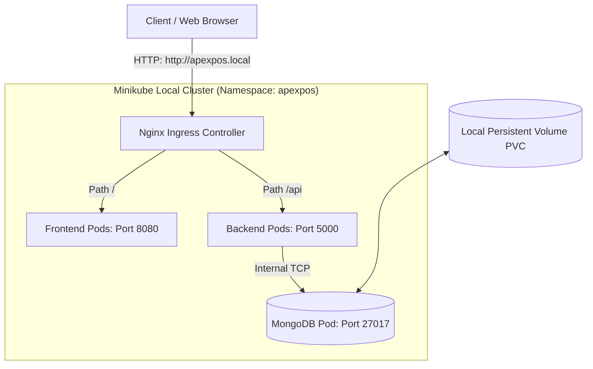
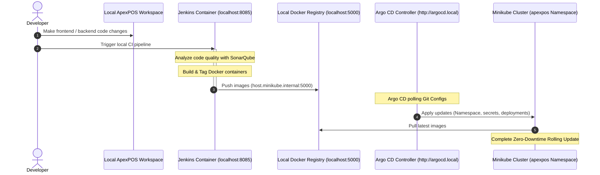
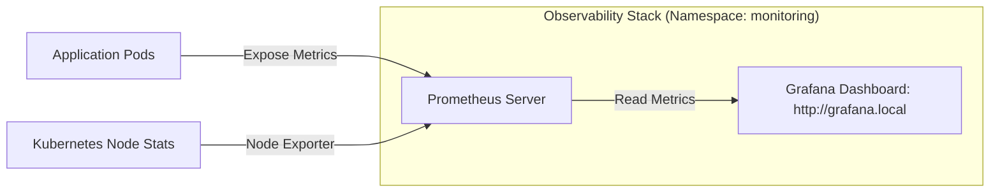

# 🛠️ ApexPOS Enterprise DevOps Infrastructure & Configuration Hub

Welcome to the **ApexPOS DevOps Infrastructure** repository. This repository houses the entire Infrastructure as Code (IaC), GitOps Continuous Delivery (CD), Kubernetes packaging (Helm), local sandbox automation, and observability setups for the ApexPOS SaaS application.

This repository is optimized for **zero-cloud-cost local sandboxing** using **Minikube** on localhost, mimicking a production-grade cloud setup with full GitOps and monitoring. It also preserves your **AWS Cloud Production IaC** as a code reference for interview showcases.

---

## 🏛️ System Architecture Diagrams

### 1. Local Kubernetes Sandbox Traffic Flow
This diagram illustrates how requests flow locally through the Nginx Ingress Controller inside the Minikube cluster using local host mapping.



---

### 2. CI/CD & GitOps Delivery Lifecycle
This diagram details the local CI/CD workflow where Jenkins builds Docker images from your workspace, pushes them to a local Docker registry, and deploys them to Minikube. Argo CD handles state reconciliation.



---

### 3. Monitoring & Observability Flow
Prometheus and Grafana are configured to scrape metrics from the Kubernetes nodes, pods, and application processes to verify stability.



---

## 📂 Repository Directory Layout

```text
├── .github/workflows/
│   └── validate.yml          # CI Pipeline (yamllint, hadolint, helm lint)
├── helm/
│   └── apexpos/              # Standardized Helm Chart for Kubernetes Packaging
│       ├── templates/        # Reusable Kubernetes YAML Templates
│       ├── Chart.yaml        # Chart configuration
│       └── values.yaml       # User-facing values file
├── k8s/                      # Raw Kubernetes manifests (Traditional Setup)
│   ├── backend/              # Raw Deployment, Service, ConfigMap & Secrets
│   ├── database/             # Raw MongoDB Stateful Pod & PVC
│   ├── frontend/             # Raw Frontend Nginx configurations
│   ├── argocd-app.yml        # Argo CD GitOps Application resource
│   └── namespace.yml         # Shared Namespace declaration
├── terraform/                # Infrastructure as Code
│   ├── local-minikube/       # [NEW] Bootstrap Minikube namespaces, ArgoCD & Prometheus/Grafana
│   │   ├── providers.tf      # Local K8s & Helm providers
│   │   ├── main.tf           # Provisioning namespaces, secrets, Helm charts
│   │   ├── variables.tf      # Local cluster configuration variables
│   │   └── outputs.tf        # Access URLs & helper print statements
│   └── aws-cloud-production/ # [PRESERVED] Production AWS network/EC2 configurations
│       ├── providers.tf, variables.tf, vpc.tf, security_groups.tf, ec2.tf, outputs.tf
├── docker-compose-infra.yml  # Local DevOps stack (Jenkins/SonarQube/Registry)
├── Dockerfile-jenkins        # Custom Jenkins container with kubectl, node, and plugins
├── init_pipeline.groovy      # Automated Jenkins pipeline configure script
└── local-infra.sh            # [NEW] Unified control script to orchestrate the platform
```

---

## 🚀 Orchestrating the Platform (`local-infra.sh`)

Instead of writing complex setup steps, a custom bash orchestrator manages the lifecycle of your local DevOps ecosystem.

### A. Bootstrapping the Platform
To launch Minikube, enable ingress, start Jenkins/SonarQube, run local Terraform, and output endpoints, simply run:
```bash
./local-infra.sh start
```

### B. Checking System Health & Endpoints
To view the current status of all pods, Docker containers, and obtain access URLs:
```bash
./local-infra.sh status
```

### C. Stopping the Sandbox
To destroy Kubernetes deployments, clear Docker containers, and stop the Minikube VM:
```bash
./local-infra.sh stop
```

---

## 🌐 Configuring Local Domains (/etc/hosts)

This project routes traffic using the Nginx Ingress Controller on custom local domains. Map these domains to your Minikube IP address:

1. Retrieve your Minikube IP:
   ```bash
   minikube ip
   ```
2. Add the mapping to your local `/etc/hosts` file (requires `sudo` privileges):
   ```text
   # Add this line (replace 192.168.49.2 with your actual minikube ip)
   192.168.49.2 apexpos.local argocd.local grafana.local
   ```
3. Now, you can access the consoles directly via your browser:
   * **ApexPOS App**: [http://apexpos.local](http://apexpos.local)
   * **ArgoCD GitOps**: [http://argocd.local](http://argocd.local)
   * **Grafana Observability**: [http://grafana.local](http://grafana.local) (Username: `admin` / Password: `admin`)
   * **Jenkins Pipeline**: `http://localhost:8085`
   * **SonarQube Analysis**: `http://localhost:9000` (Username: `admin` / Password: `SonarQubeAdmin123_`)

---

## 🏗️ Local Infrastructure as Code (Terraform)

Rather than using Terraform to deploy cloud servers, we write Terraform to manage resources *inside* the Kubernetes cluster. This demonstrates production-grade IaC skills without paying cloud costs.

The configurations inside `terraform/local-minikube` execute the following:
* **Kubernetes Namespaces**: Declaratively creates `apexpos`, `monitoring`, and `argocd`.
* **Secrets Management**: Deploys `backend-secrets` with JWT tokens securely.
* **Argo CD Release**: Installs the official Helm chart and configures ingress paths and `--insecure` arguments for local development.
* **Observability Stack**: Installs the `kube-prometheus-stack` Helm chart (Prometheus/Grafana) and opens ingress mappings.

To apply changes manually:
```bash
cd terraform/local-minikube
terraform init
terraform apply -auto-approve
```

---

## ⛵ Kubernetes Packaging (Helm Chart)

The Helm Chart located in `helm/apexpos/` acts as a parameterized template for the ApexPOS deployments, separating configuration values from YAML structures.

### Lint Chart:
```bash
helm lint helm/apexpos/
```

### Dry Run (Debugging):
```bash
helm install apexpos-prod helm/apexpos/ --dry-run --debug -n apexpos
```

### Install Release:
```bash
helm install apexpos-prod helm/apexpos/ --namespace apexpos --create-namespace
```

---

## 🔄 Local GitOps Delivery (Argo CD)

Argo CD matches the live Kubernetes cluster state to this Git repository, preventing configuration drift.

1. Install via Terraform (automated by `./local-infra.sh start`).
2. Map `argocd.local` in your `/etc/hosts`.
3. Register the application to sync configurations from your local `k8s` directory:
   ```bash
   kubectl apply -f k8s/argocd-app.yml
   ```
   Argo CD will automatically sync resources into the `apexpos` namespace and self-heal any modifications.

---

## 🧪 Automated CI Validation (GitHub Actions)

Upon any push or pull request to the `main` or `dev` branches, the GitHub Actions pipeline (`validate.yml`) runs:
* **Dockerfile Linting**: Inspects the Jenkins Dockerfile for security and package pinning violations using `hadolint`.
* **Kubernetes YAML Validation**: Checks Kubernetes manifests for syntax irregularities using `yamllint`.
* **Helm Chart Checks**: Asserts Helm charts structure using `helm lint`.
