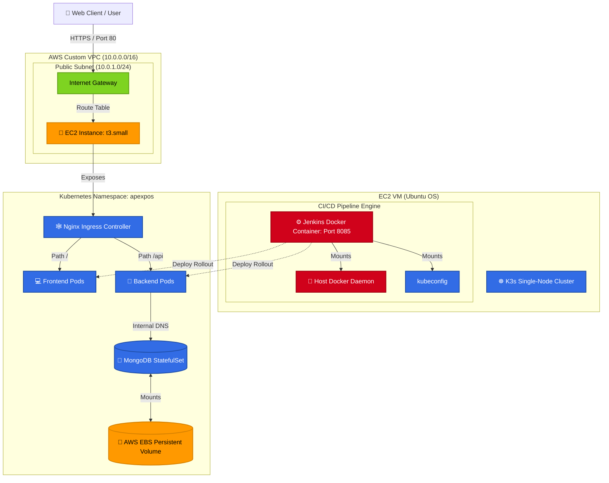
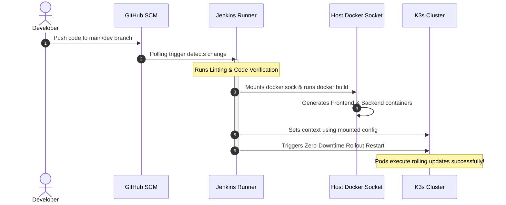

# ☁️ ApexPOS DevOps Infrastructure & Orchestration Hub

[](https://www.terraform.io/)
[](https://kubernetes.io/)
[](https://helm.sh/)
[](https://aws.amazon.com/)
[](https://www.jenkins.io/)
[](https://www.docker.com/)

This repository serves as the central **Infrastructure as Code (IaC)**, **GitOps**, and **Orchestration Hub** for the ApexPOS software suite. It includes Terraform configurations, Kubernetes raw manifests, Helm Charts, and continuous deployment workflows that power the platform's production cloud infrastructure.

---

## 🏛️ Overall DevOps & Network Architecture

The deployment architecture features a highly automated deployment flow on **AWS EC2** running a single-node **K3s Kubernetes cluster**.



---

## 📁 Repository Directory Layout

```text
├── helm/
│   └── apexpos/              # Premium Helm chart packaging for ApexPOS
│       ├── templates/        # Kubernetes resource templates (Deployments, Services, Ingress)
│       ├── Chart.yaml        # Chart metadata
│       └── values.yaml       # Global values configurations
├── k8s/                      # Raw Kubernetes manifests (Alternative to Helm)
│   ├── namespace.yml         # Shared Namespace setup
│   ├── backend/              # Deployment, ClusterIP Service, ConfigMap & Secrets
│   ├── database/             # MongoDB StatefulSet & PersistentVolumeClaim
│   ├── frontend/             # Nginx reverse proxy configuration & UI Deployment
│   └── ingress.yml           # Traffic routing rule manifest
└── terraform/                # Infrastructure as Code (IaC)
    └── aws-cloud-production/ # Production environment VPC & Host setup
        ├── providers.tf      # Cloud provider configurations
        ├── variables.tf      # System variables & defaults
        ├── vpc.tf            # Custom VPC, subnets, route tables, & gateway
        ├── security_groups.tf# Firewall rules for HTTP/HTTPS/SSH/Jenkins
        ├── ec2.tf            # EC2 instance bootstrapping (Docker, K3s, Jenkins setups)
        └── outputs.tf        # Access IP addresses & host values
```

---

## 🛠️ Infrastructure Provisioning (Terraform)

The Infrastructure as Code (IaC) logic creates a customized secure virtual networking stack on AWS to host K3s.

### Resources Provisioned
* **VPC**: Isolated custom network (`10.0.0.0/16`).
* **Subnets**: Public subnets for incoming HTTP/HTTPS traffic.
* **Security Group**: 
  * Port `22` (SSH) — Restricted remote access.
  * Ports `80` & `443` (HTTP/HTTPS) — Web app traffic.
  * Port `8085` — Jenkins CI/CD dashboard.
  * Ports `30080` & `30500` — NodePorts for direct service routing.
* **EC2 Bootstrapping**: installs Docker, mounts swap storage, runs lightweight K3s, copies `/etc/rancher/k3s/k3s.yaml` to user space for remote kubectl access, and runs the Jenkins pipeline engine inside Docker.

### How to Deploy
Ensure you have the AWS CLI configured, then:
```bash
cd terraform/aws-cloud-production
terraform init
terraform plan
terraform apply -auto-approve
```

---

## ⚙️ CI/CD Jenkins Pipeline Configuration

Our CI/CD engine is hosted locally in a Docker container with mounted sockets for fast, zero-cost builds.

### Pipeline Lifecycle Workflow


### Jenkins Setup Highlights
1. **Dynamic CLI Support**: Since the Jenkins base image lacks the Docker executable, our setup scripts dynamically fetch the static docker binary `v26` and copy it directly to `/usr/local/bin/docker`.
2. **Docker Socket Mounting**: Jenkins accesses the host's system engine via `-v /var/run/docker.sock:/var/run/docker.sock`, avoiding "Docker-in-Docker" performance degradation.
3. **No Setup Wizard**: Admin user configuration screens are bypassed (`-e JAVA_OPTS="-Djenkins.install.runSetupWizard=false"`) for instant deployment configuration.

---

## 📝 Common Kubernetes Operations Cheat Sheet

### 1. View Cluster Resources
```bash
# Check all resources in the apexpos namespace
sudo kubectl get all -n apexpos

# Check PV/PVC binding status
sudo kubectl get pv,pvc -n apexpos
```

### 2. Tail Live Application Logs
```bash
# Read logs for backend deployment
sudo kubectl logs -n apexpos deployment/apexpos-backend --tail=100 -f

# Read logs for frontend deployment
sudo kubectl logs -n apexpos deployment/apexpos-frontend --tail=100 -f
```

### 3. Database Maintenance and Seeding
Since the MongoDB pod resides inside the private cluster network, execute the node scripts by piping local files into the running pod:

* **Seeding Administrator credentials**:
  ```bash
  ssh -i "apex-pos.pem" ubuntu@<EC2_IP> "sudo kubectl exec -i -n apexpos deployment/apexpos-backend -- node" < "../ApexPOS/server/seedAdmin.js"
  ```

* **Seeding Sample Items & Categories**:
  ```bash
  ssh -i "apex-pos.pem" ubuntu@<EC2_IP> "sudo kubectl exec -i -n apexpos deployment/apexpos-backend -- node" < "../ApexPOS/server/seedProducts.js"
  ```

* **Verify MongoDB Database Status**:
  ```bash
  sudo kubectl exec -it -n apexpos sts/apexpos-database -- mongosh --eval "db.getSiblingDB('apexpos').staffs.find().pretty()"
  ```
