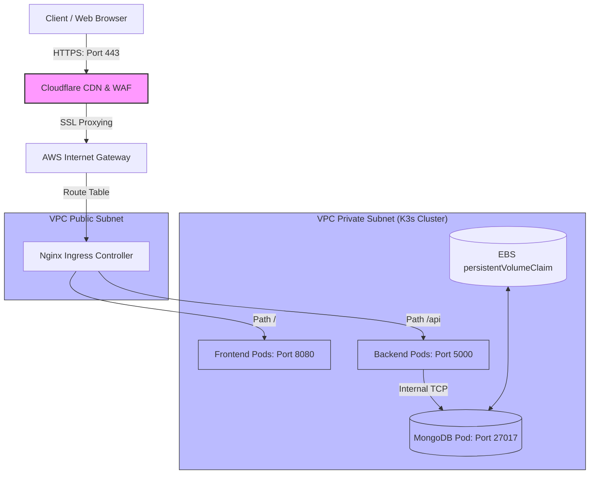
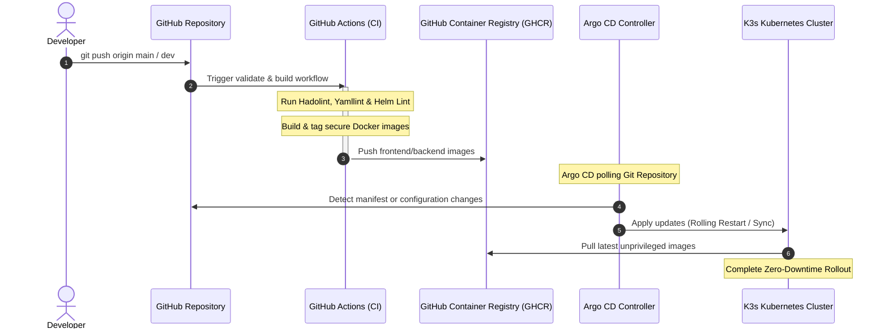
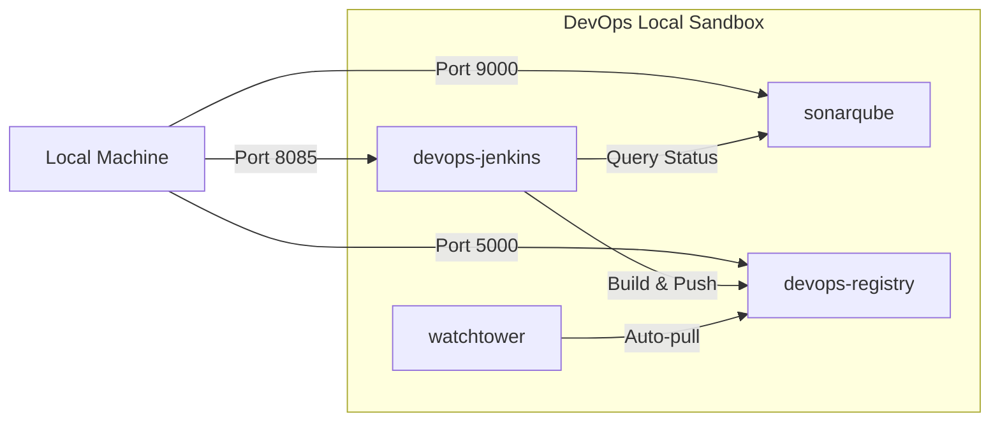

# 🛠️ ApexPOS Enterprise DevOps Infrastructure & Configuration Hub

Welcome to the **ApexPOS DevOps Infrastructure** repository. This repository houses the entire Infrastructure as Code (IaC), GitOps Continuous Delivery (CD), Kubernetes packaging (Helm), and local development automation configurations for the ApexPOS SaaS application.

This hub is designed to support a scalable, secure, and cost-optimized deployment pipeline, demonstrating cloud engineering best practices.

---

## 🏛️ System Architecture Diagrams

### 1. Cloud Production Traffic Flow
This diagram illustrates how a customer's request flows securely through DNS, CDN, and Ingress to the unprivileged containers inside the Kubernetes cluster.



---

### 2. CI/CD & GitOps Delivery Lifecycle
This diagram details the fully automated validation and release lifecycle. Code changes in Git trigger automated linting, container compilation, and GitOps synchronization.



---

### 3. Local Development Sandbox Infrastructure
For offline testing and sandbox verification, Docker Compose spins up a local CI/CD environment with Jenkins, SonarQube, and a local Docker Registry.



---

## 📂 Repository Directory Layout

```text
├── .github/workflows/
│   └── validate.yml          # CI Pipeline (yamllint, hadolint, helm lint)
├── helm/
│   └── apexpos/              # Standardized Helm Chart for Kubernetes Packaging
│       ├── templates/        # Reusable Kubernetes YAML Templates
│       │   ├── _helpers.tpl  # Label & Name generators
│       │   ├── backend-*.yaml# API Deployment & Service
│       │   ├── frontend-*.yaml# Frontend Nginx Deployment & Service
│       │   ├── mongodb-*.yaml# Stateful database config & PVCs
│       │   ├── configmap.yaml# App properties ConfigMap
│       │   ├── secrets.yaml  # Base64 encrypted secrets placeholder
│       │   └── ingress.yaml  # Nginx Ingress routing template
│       ├── Chart.yaml        # Chart configuration
│       └── values.yaml       # User-facing values file
├── k8s/                      # Raw Kubernetes manifests (Traditional Setup)
│   ├── backend/              # Raw Deployment, Service, ConfigMap & Secrets
│   ├── database/             # Raw MongoDB Stateful Pod & PVC
│   ├── frontend/             # Raw Frontend Nginx unprivileged configs
│   ├── argocd-app.yml        # Argo CD GitOps Application resource
│   └── namespace.yml         # Shared Namespace declaration
├── terraform/                # Infrastructure as Code (AWS Provisioning)
│   ├── providers.tf          # Terraform & AWS Providers
│   ├── variables.tf          # Configurable variables (region, size, keys)
│   ├── vpc.tf                # VPC, Subnets, Gateways & Route Tables
│   ├── security_groups.tf    # Port configurations
│   ├── ec2.tf                # Cluster server & K3s bootstrap scripting
│   └── outputs.tf            # Command helper outputs
├── docker-compose-app.yml    # Local multi-container stack (Frontend/Backend/DB)
├── docker-compose-infra.yml  # Local DevOps stack (Jenkins/SonarQube/Registry)
└── Dockerfile-jenkins        # Custom Jenkins container with kubectl, node, and plugins
```

---

## 🚀 1. Local Sandboxing (Docker Compose)

### A. DevOps Infrastructure Stack
Runs Jenkins, SonarQube, Postgres DB, a local Docker registry, and Watchtower.
```bash
docker compose -f docker-compose-infra.yml up -d
```
* **Jenkins**: `http://localhost:8085` (Unsecured sandbox configuration)
* **SonarQube**: `http://localhost:9000` (Default credential `admin:SonarQubeAdmin123_`)
* **Docker Registry**: `http://localhost:5000`

### B. Application Stack
Runs the fully functional application stack (client, server, database) on localhost:
```bash
docker compose -f docker-compose-app.yml up -d
```
* **Frontend**: `http://localhost` (Routes requests to unprivileged container port `8080`)
* **Backend API**: `http://localhost:5000`
* **MongoDB**: `localhost:27017`

---

## ⛵ 2. Kubernetes Packaging (Helm Chart)

The Helm Chart simplifies variable substitution across multiple environments (Dev, Staging, Prod).

### Lint Chart:
```bash
helm lint helm/apexpos/
```

### Install Release:
```bash
helm install apexpos-prod helm/apexpos/ --namespace apexpos --create-namespace
```

### Dry Run (Debugging):
```bash
helm install apexpos-prod helm/apexpos/ --dry-run --debug -n apexpos
```

### Upgrade Release:
```bash
helm upgrade apexpos-prod helm/apexpos/ --set ingress.enabled=true -n apexpos
```

---

## 🏗️ 3. Infrastructure as Code (Terraform)

Terraform provisions AWS cloud infrastructure that hosts the Kubernetes cluster.

1. **Initialize Terraform & Get Plugins**:
   ```bash
   cd terraform
   terraform init
   ```
2. **Preview Plan**:
   ```bash
   terraform plan -var="key_name=my-aws-key"
   ```
3. **Provision Resources**:
   ```bash
   terraform apply -var="key_name=my-aws-key" --auto-approve
   ```
4. **Copy Kubeconfig Locally**:
   ```bash
   # Run the command generated by the output to configure local kubectl
   ssh -i my-aws-key.pem ubuntu@<EC2_IP> 'sudo cat /etc/rancher/k3s/k3s.yaml' | sed 's/127.0.0.1/<EC2_IP>/g' > ./k3s-kubeconfig
   export KUBECONFIG=$(pwd)/k3s-kubeconfig
   ```

---

## 🔄 4. GitOps with Argo CD

Argo CD implements automated delivery by matching the cluster state to this GitHub repository.

1. **Install Argo CD**:
   ```bash
   kubectl create namespace argocd
   kubectl apply -n argocd -f https://raw.githubusercontent.com/argoproj/argo-cd/stable/manifests/install.yaml
   ```
2. **Apply GitOps Manifest**:
   ```bash
   kubectl apply -f k8s/argocd-app.yml
   ```
   Argo CD will automatically sync configurations, pull the raw manifests from the `k8s/` folder, and monitor health status.

---

## 🧪 5. Automated CI Validation (GitHub Actions)

Upon any push or pull request to the `main` or `dev` branches, the DevOps pipeline (`validate.yml`) is triggered to run:
* **Dockerfile Linting**: Inspects the Jenkins Dockerfile for security and package pinning violations using `hadolint`.
* **Kubernetes YAML Validation**: Checks Kubernetes manifests for syntax irregularities using `yamllint`.
* **Helm Chart Checks**: Asserts Helm charts structure using `helm lint`.

---

## 🔄 How to Work This System (Workflow)

This platform separates your application code from your infrastructure configuration. Here is the operational lifecycle for working with this setup:

### 1. Making Application Changes (Frontend/Backend)
* **Local Development**:
  1. Open your code in the sibling [ApexPOS](https://github.com/Ntharusha/ApexPOS) repository.
  2. Start the backend (`cd server && npm run dev`) and frontend (`cd client && npm run dev`) to test features locally.
* **Production Deployment**:
  1. Stage, commit, and push your changes inside the `ApexPOS` repository:
     ```bash
     git add .
     git commit -m "feat: add new modules"
     git push origin dev
     ```
  2. **CI/CD Automation**: GitHub Actions runs automatically in the background to lint code, compile Docker containers, push the new images to GitHub Packages (`ghcr.io`), and trigger a zero-downtime rolling restart in your Kubernetes cluster.

### 2. Making Infrastructure/DevOps Changes
* If you need to modify server specs, Kubernetes configurations, or Helm charts:
  1. Navigate to this repository (`devops-repo`).
  2. Make changes to Terraform scripts, Helm templates (`values.yaml`), or Kubernetes manifests.
  3. Push changes to GitHub:
     ```bash
     git add .
     git commit -m "config: increase backend memory allocation"
     git push origin main
     ```
  4. **GitOps Automation**: **Argo CD** automatically detects your changes, pulls the new manifests, and synchronizes the cluster state without you ever needing to run manual deployment commands!

